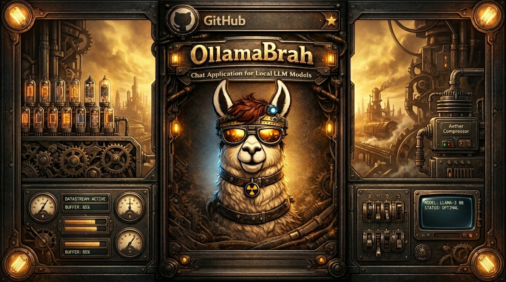

# OllamaBrah



A desktop chat client for local [Ollama](https://ollama.com) and [llama.cpp](https://github.com/ggerganov/llama.cpp) models. Built with Electron.

> Ported from the [OllamaBro browser extension](https://github.com/BorisHrzenjak/OllamaBro) — all the same features, now as a standalone desktop app.

---

## What's New — v1.1.4

- **Dashboard now prefers migrated history correctly** — when both legacy and new safe chat-state keys exist, OllamaBrah now uses the migrated entry first so recent usage is not masked by an older empty legacy record
- **Safer chat-state storage keys** — new model history is saved under a dot-safe key format with legacy fallback, which prevents future dashboard mismatches and keeps old conversations readable

---

## Features

### Models & Backends
- **Ollama** — chat with any locally installed Ollama model
- **llama.cpp** — run GGUF models directly via `llama-server`; configure binary path, models directory, GPU layers, context size, and server port
- Document attachments work with `llama.cpp` even when image attachments are unavailable
- Model switcher, model management, and dashboard views with live availability checking plus separate local, cloud, and `llama.cpp` sections
- Dot-safe model history storage with legacy migration so dashboard and usage stats stay accurate for future model names
- Startup diagnostics for Ollama, llama.cpp, memory, and voice prerequisites with guided recovery actions
- Auto-detect context window size per model
- Override context limit manually
- Adjust model parameters per model: temperature, top-p, top-k, repeat penalty, max tokens, seed
- Pull new models from the Ollama registry
- Update individual models or bulk-update all at once
- Hardware-based model recommendations via llmfit integration

### Chat
- Full streaming responses with stop button
- Thinking/reasoning model support — collapsible reasoning blocks (DeepSeek, QwQ, etc.)
- Multiple conversations per model with search and tag filtering
- Message history navigation with `↑` / `↓`
- Pin messages to preserve them in context
- Per-message actions: copy, read aloud, download as TXT or Markdown, remove
- Drag & drop file attachments
- Supported file types: images, PDF, TXT, Markdown, Python, JS, TS, JSON, HTML, CSS, SQL, Shell, YAML, XML, CSV, logs
- Document attachments are chunked and summarized automatically, with only the most relevant excerpts injected into context on each turn
- Attached documents stay useful on follow-up questions instead of being pasted in full every time
- Export full conversations as Markdown
- Context meter showing token breakdown (system prompt / search / conversation)

### Input Modes
- **Web search** — augment responses with live Tavily search results
- **Deep research** — multi-step Exa research pipeline before answering
- **Agent mode** — autonomous tool-use loop with step-by-step visualization; configure max steps, tool permissions, allowed directories, and blocked paths
- **Memory** — semantic memory using `nomic-embed-text` embeddings; auto-inject and auto-extract toggles; full memory manager with search, add, and clear
- Semantic memory search in the memory manager, with provenance like source type, extraction mode, and linked conversation/message metadata
- Auto-extracted memories save directly with provenance and deduplication, and replies can show which memories were used in context

### Voice & Audio
- **Voice input** — speech-to-text via Whisper *(requires Python + faster-whisper)*
- **Text-to-speech** — read responses aloud; choose between Browser (Web Speech API) or Kokoro engine; configurable voice selection

### Personas & Prompts
- System prompt editor with token counter
- Persona presets — save, edit, and switch between named system prompts
- Slash commands — custom prompt shortcuts with autocomplete (`/command`)

### Themes
- **Dark:** Default, Dracula, Tokyo Night, Catppuccin Mocha, Kanagawa, Rosé Pine, Nord, Night Owl, One Dark Pro
- **Light:** GitHub Light, Solarized Light, Catppuccin Latte, Kanagawa Lotus, Rosé Pine Dawn, Nord Light, Night Owl Light, One Light

### Keyboard Shortcuts

| Action | Shortcut |
|---|---|
| Send message | `Enter` / `Ctrl+Enter` |
| New chat | `Ctrl+N` |
| Delete conversation | `Ctrl+D` |
| Read last response aloud | `Ctrl+R` |
| Abort generation | `Esc` |
| Browse message history | `↑` / `↓` |
| Show shortcuts panel | `Ctrl+H` |
| Toggle voice input | `Alt+V` |
| Add file | `Ctrl+I` |
| Toggle web search | `Alt+W` |
| Toggle deep research | `Alt+R` |
| Toggle agent mode | `Alt+A` |
| Toggle memory | `Ctrl+M` |

---

## Installation

**Prerequisites**
- [Node.js](https://nodejs.org) v18+
- [Ollama](https://ollama.com) installed and running
- Python 3 *(optional — voice input only)*

**Run from source**
```bash
git clone https://github.com/BorisHrzenjak/ollama_brah.git
cd ollama_brah
npm install
npx electron-rebuild
npm start
```

> `electron-rebuild` is required because `better-sqlite3` is a native addon that must be compiled against Electron's bundled Node version. Skipping this step will cause a crash on startup.

**Build a distributable**
```bash
npm run build
```
Produces a Windows installer in `/dist`.

---

## Notes

- Ollama must be running before launching the app (`ollama serve`)
- Pull at least one model first: `ollama pull <model-name>`
- The internal proxy runs on `localhost:3456` — make sure that port is free
- Memory feature requires the `nomic-embed-text` model: `ollama pull nomic-embed-text`
- Voice input requires: `pip install faster-whisper`
